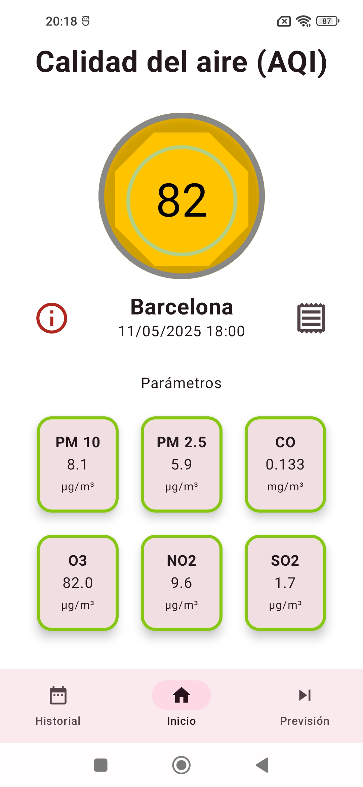
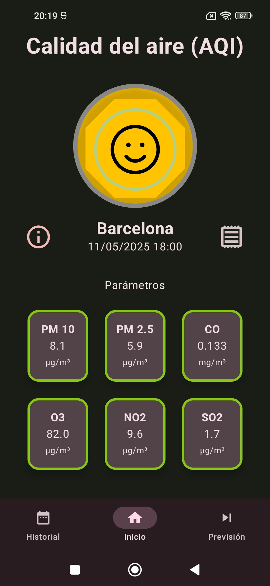
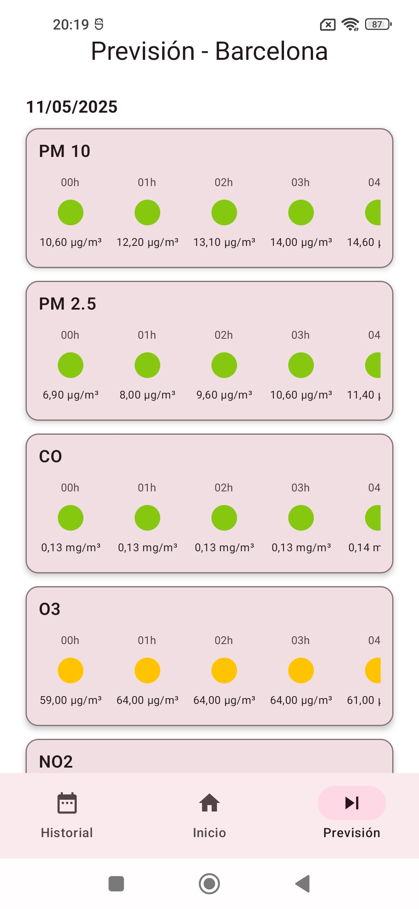

# 🌬️ AirCheck

AirCheck is a minimalist Android app that shows air quality in your location using data from [Open-Meteo](https://open-meteo.com/). It was built with Jetpack Compose and follows Clean Architecture principles, designed as my first app to showcase Android development skills.

AirCheck es una aplicación Android minimalista que muestra la calidad del aire en tu ubicación utilizando datos de [Open-Meteo](https://open-meteo.com/). Está desarrollada con Jetpack Compose y basada en Clean Architecture, creada como mi primera app para mostrar mis habilidades como desarrollador Android.

---

## ✨ Features 

- 📍 Real-time location-based air quality data  
- 🕒 Historic and forecast views  
- 🌡️ Air quality index with dynamic colors and descriptions  
- 📊 Parameter breakdown (PM2.5, PM10, O₃, NO₂, CO, SO₂)  
- 🧩 Material You + Dynamic Color support  
- 📵 Offline fallback with default location  
- 🌙 Light/Dark theme support  

---

## 📸 Screenshots

| Home | Home (Dark) | Forecast |
|------|----------|----------|
|  |  |  |

---

## 🛠️ Tech Stack

- Kotlin + Jetpack Compose
- MVVM + Clean Architecture
- Koin for DI
- Coroutine Flows
- Material 3 + Dynamic Colors
- Open-Meteo API

---

## 📂 Architecture

This project uses a layered architecture for better scalability and testability:

- `app` → UI layer (Jetpack Compose)
- `domain` → Use cases and models
- `data` → Repositories and data sources
- `shared` → Utility classes and constants

---

## 📄 License & Credits

- All data provided by [Open-Meteo](https://open-meteo.com/)
- Icons from [Pixabay](https://pixabay.com) with proper attribution in-app
- This project is open-source for learning and portfolio purposes  
  Licensed under [MIT License](LICENSE)

---

## 🚀 Author

Created with ❤️ by Jose Vicente Mirabel Rodrigo 
Feel free to connect via [LinkedIn](www.linkedin.com/in/josevmirabel) or visit my [GitHub profile](https://github.com/josevmr))

---

